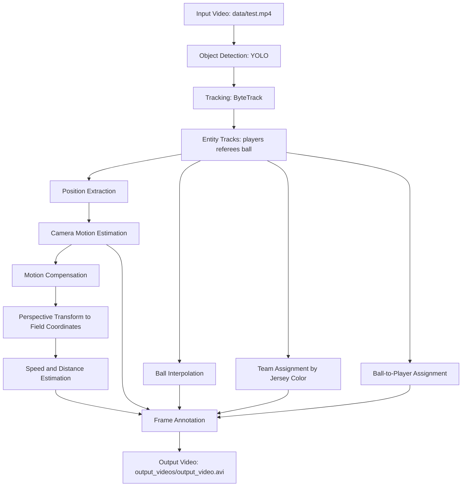

# Football Video Intelligence Pipeline: Tracking, Team Assignment, and Motion Analytics

**Trained model on Hugging Face:** [`gianpaj/football-players-detection-1`](https://huggingface.co/gianpaj/football-players-detection-1) — fine-tuned YOLOv8x detecting players, goalkeepers, referees, and the ball. See [6.1 Get the trained model](#61-get-the-trained-model-recommended) to download the ready-to-use weights instead of training from scratch.

## 1. Overview
This project is a computer-vision pipeline for football match analysis that transforms raw broadcast video into structured, frame-level analytics. It detects players, referees, and the ball; tracks entities across frames; compensates for camera motion; maps motion to a field-relative coordinate system; estimates player speed and distance; assigns teams by jersey color clustering; and estimates ball possession over time.

From an engineering perspective, the system solves a core sports analytics problem: converting noisy visual streams into stable, quantitative signals that can support tactical analysis, performance monitoring, and downstream AI/ML workflows.

Why this matters:
- Broadcast video is abundant, but raw pixels are not directly actionable.
- Reliable tracking + geometric normalization is the bridge from video to analytics.
- This pipeline demonstrates end-to-end systems thinking: perception, tracking, transformation, feature computation, and annotated output generation.

## 2. Features
- YOLO-based detection for players, referees, and ball.
- Multi-object tracking with ByteTrack for temporal identity consistency.
- Ball trajectory interpolation to fill missing detections.
- Camera motion estimation using sparse optical flow (Lucas-Kanade).
- Motion-compensated position adjustment per frame.
- Perspective transform from image plane to field-relative coordinates.
- Team assignment via KMeans clustering on player jersey colors.
- Ball possession attribution using nearest-player heuristic.
- Per-player speed (`km/h`) and cumulative distance (`m`) estimation.
- Rendered annotated output video with overlays for tracks, possession, camera movement, speed, and distance.
- Stub-based caching for faster iteration during development.

## 3. Tech Stack
- Python
- OpenCV (`cv2`) for video I/O, optical flow, geometry transforms, and rendering
- Ultralytics YOLO for object detection
- Supervision (ByteTrack integration) for tracking
- NumPy for vectorized numerical operations
- Pandas for interpolation of ball trajectories
- scikit-learn (`KMeans`) for unsupervised team color clustering
- Pickle for serialized stub caching

## 4. Architecture / Workflow


## 5. Project Structure
```text
football_analysis_yolo/
+-- main.py                                 # End-to-end pipeline orchestrator
+-- yolo_inference.py                       # Standalone YOLO inference test script
+-- image.png                               # Sample output snapshot
+-- trackers/
�   +-- tracker.py                          # Detection, ByteTrack tracking, annotations
+-- camera_movement_estimator/
�   +-- camera_movement_estimator.py        # Optical-flow camera motion estimation
+-- view_transformer/
�   +-- view_transformer.py                 # Perspective mapping to field coordinates
+-- speed_and_distance_estimator/
�   +-- speed_and_distance_estimator.py     # Speed/distance computation and overlays
+-- team_assigner/
�   +-- team_assigner.py                    # Team clustering from jersey color features
+-- player_ball_assigner/
�   +-- player_ball_assigner.py             # Ball possession assignment heuristic
+-- utils/
�   +-- video_utils.py                      # Video read/write helpers
�   +-- bbox_utils.py                       # Geometric and distance helper functions
+-- stubs/
    +-- track_stubs.pkl                     # Cached object tracks
    +-- camera_movement_stub.pkl            # Cached camera motion values
```

## 6. Installation

### Option A — uv (recommended)
```bash
git clone <your-repo-url>
cd football_analysis_yolo
uv sync
```

### Option B — pip
```bash
git clone <your-repo-url>
cd football_analysis_yolo
python -m venv .venv
source .venv/bin/activate          # Linux/macOS
# .venv\Scripts\activate           # Windows

pip install ultralytics supervision opencv-python numpy pandas scikit-learn roboflow
```

### 6.1 Get the trained model (recommended)

The trained weights are published on the Hugging Face Hub — no training required. Download `best.pt` and place it at the path `main.py` expects (`models/best.pt`):

```bash
# with the huggingface_hub CLI (pip install huggingface_hub)
hf download gianpaj/football-players-detection-1 weights/best.pt --local-dir models/hf
cp models/hf/weights/best.pt models/best.pt
```

Or from Python:

```python
from huggingface_hub import hf_hub_download
import shutil

path = hf_hub_download(repo_id="gianpaj/football-players-detection-1", filename="weights/best.pt")
shutil.copy(path, "models/best.pt")
```

Model card, evaluation metrics, and training details: <https://huggingface.co/gianpaj/football-players-detection-1>

> The model is a YOLOv8x fine-tune (4 classes: ball, goalkeeper, player, referee). It detects players/referees/goalkeepers very well (mAP50 ≥ 0.96) but ball detection is weak (recall ≈ 0.40) — the pipeline's ball interpolation compensates for the frequently-missed ball.

If you just want to run the pipeline, skip to [6.4 Prepare input video](#64-prepare-input-video). Sections 6.2–6.3 below are only needed to retrain the model yourself.

### 6.2 Download the training dataset (optional — for retraining)

To retrain from scratch, download the dataset from Roboflow (free account required at [roboflow.com](https://roboflow.com)):

```python
from roboflow import Roboflow

rf = Roboflow(api_key="YOUR_API_KEY")
project = rf.workspace("roboflow-jvuqo").project("football-players-detection-3zvbc")
version = project.version(1)
version.download("yolov8", location="models/football-players-detection-1")
```

This creates:
```
models/football-players-detection-1/
  data.yaml
  train/images/   (612 images)
  valid/images/   (38 images)
  test/images/
```

Fix the paths in `data.yaml` (Roboflow generates them with a leading `../` that is incorrect for this layout):

```bash
sed -i 's|../train/images|train/images|; s|../valid/images|valid/images|; s|../test/images|test/images|' \
  models/football-players-detection-1/data.yaml
```

### 6.3 Train the YOLO model (optional)

```bash
uv run yolo train \
  model=yolov8x.pt \
  data=models/football-players-detection-1/data.yaml \
  epochs=100 \
  imgsz=640 \
  project=models \
  name=football_yolo \
  device=0
```

- `device=0` uses the first GPU. Use `device=cpu` if no GPU is available (much slower).
- Swap `yolov8x.pt` for `yolov8n.pt` (nano) for a quick smoke-test run before committing to the full training.
- Training on an RTX 4060 Ti takes roughly 30–60 minutes for 100 epochs.

Copy the best weights to the expected path:

```bash
cp models/football_yolo/weights/best.pt models/best.pt
```

### 6.4 Prepare input video

Place your broadcast football video at:
```
data/test.mp4
```

## 7. Usage

Run the full analysis pipeline:
```bash
# with uv
uv run python main.py

# or with activated venv
python main.py
```

Run YOLO-only quick check:
```bash
uv run python yolo_inference.py
```

Output is written to `output_videos/output_video.avi` (directory is created automatically).

Implementation note:
- `main.py` currently reads detection/tracking and camera-motion data from stubs (`read_from_stub=True`) for faster development loops.
- Set these flags to `False` in `main.py` to recompute from raw video.

### 7.1 Live pipeline (HLS / RTSP / webcam → WebSocket)

`main.py` above is the **offline batch** path: it loads a whole recorded file, analyses it, and writes an annotated video. For a **live broadcast feed** there is a separate incremental path that runs the same detection/tracking/analytics frame-by-frame and streams structured JSON stats over a WebSocket instead of drawing to screen:

```bash
# webcam smoke test (index 0), prints per-frame summaries to stdout
python main_live.py --source 0 --no-ws

# real broadcast HLS feed, stats served to WebSocket subscribers on :8765
python main_live.py --source https://example.com/stream.m3u8 --model models/best.pt --ws-port 8765
```

`--source` accepts an HLS `.m3u8` URL, an RTSP URL, a local file, or a webcam index. Connect any WebSocket client to `ws://<host>:8765` to receive one JSON message per processed frame: player positions/teams/speeds, ball position (or `null` when lost), running possession %, and a `camera_stable` flag.

The live code lives in the additive `live/` package (`ResilientCapture`, `SceneCutDetector`, `StatsBroadcaster`, `LiveFootballAnalyzer`) and reuses the existing estimators via new streaming methods; the offline `main.py` path is unchanged. Known v1 limitations (multi-camera cuts gate position-derived stats rather than recalibrating homography; HLS inherently trails the live event by ~10–40 s; frames are resized to 1920×1080 to match the calibrated pixel constants) are documented in the plan and in `live/pipeline.py`.

### 7.2 Benchmark detector backbones

For a real-time feed, detector **latency** matters as much as mAP. `scripts/bench_models.py` compares candidate bases (e.g. `yolov8x` vs `yolo11m/l/x`) on val mAP — with the tiny-**ball** class AP called out separately — and median/p90 per-frame `predict` latency measured exactly how `Tracker.track_frame` calls it:

```bash
# latency-only shootout (downloads the bases on first use, no dataset needed)
python scripts/bench_models.py \
  --models yolov8x.pt yolo11m.pt yolo11l.pt yolo11x.pt \
  --source data/test.mp4 --device 0

# full accuracy + latency, fine-tuning each base on the football set first
python scripts/bench_models.py \
  --models yolov8x.pt yolo11m.pt yolo11l.pt \
  --data models/football-players-detection-1/data.yaml \
  --train --epochs 100 --imgsz 640 --device 0 --out bench_results.json
```

val mAP is only meaningful on weights fine-tuned on the football data (`--train`, or point `--models` at trained `best.pt` files); latency works on any base. Try `--imgsz 1280` to see the ball-recall vs latency trade-off.

## 8. Example Output
Generated artifact:
- `output_videos/output_video.avi`

Frame overlays include:
- Player/referee/ball markers and IDs
- Team-wise possession percentage
- Camera movement `X/Y`
- Player speed (`km/h`) and distance (`m`)

Sample visualization:


## 9. Engineering Insights
- Detection and tracking separation: YOLO handles perception; ByteTrack enforces temporal continuity.
- Numerical robustness: missing ball detections are interpolated with Pandas before downstream analytics.
- Camera-motion compensation: optical-flow offsets reduce ego-motion bias in movement statistics.
- Geometric normalization: perspective mapping converts image coordinates into a field-referenced frame for physically meaningful distance/speed estimates.
- Practical caching: pickle stubs reduce iteration time while debugging visualization and metric logic.

Trade-offs:
- Team assignment via color clustering is efficient but sensitive to lighting, jersey similarity, and occlusion.
- Fixed frame-rate assumptions (`24 FPS`) simplify speed estimation but should be generalized for production.
- Ball possession heuristic (nearest foot-point under threshold) is interpretable but can fail in dense crowding.

Performance/scalability considerations:
- Detection is batched (`batch_size=20`) to improve inference throughput.
- For larger workloads, this architecture can be extended to stream processing, asynchronous stages, and GPU-backed inference services.

## 10. Learning Journey & AI/ML Foundations
### A. Computational & Mathematical Foundations
My foundation is rooted in computational thinking that directly aligns with AI/ML engineering:
- Mathematical modeling of dynamic systems.
- Numerical methods and computational solving strategies.
- Algorithmic problem-solving under real-world constraints.
- Matrix/vector-style computation patterns used in NumPy-based pipelines.
- Structured data transformation workflows conceptually aligned with Pandas-style processing.

### B. Current Academic Direction
I am currently pursuing an M.Tech in AI/ML, with academic focus on:
- Machine learning
- Deep learning
- Natural language processing (NLP)
- AI systems engineering

### C. Self-Driven Learning Narrative
This project is part of my self-driven transition into AI/ML engineering. I intentionally build implementation-heavy systems to connect theory with production-style execution, especially across computer vision pipelines, backend-oriented data flow, and model-adjacent analytics.

### D. Project to AI/ML Mapping
How this project connects to AI/ML system design:
- Tracking and trajectory extraction are foundational for behavior modeling and predictive analytics.
- Perspective transformation and motion compensation reflect the same geometric/data normalization principles used in robust ML preprocessing.
- Speed/distance derivation is feature engineering on spatiotemporal data.
- Modular pipeline stages mirror ML system architecture patterns (ingestion, transformation, feature computation, output serving).
- Stub-driven iteration mimics reproducible experimentation workflows used in model development.

### E. Narrative Positioning
This project is part of my transition into AI/ML, where I apply strong foundations in computational modeling and numerical methods to build scalable and intelligent systems.

### F. Core Insight
Even before specializing in AI/ML, I was working with computational algorithms, numerical methods, and system modeling, which form the backbone of modern machine learning systems.

## 11. Challenges & Learnings
- Camera movement confounds naive motion estimates; compensation is necessary before player-level kinematics.
- Ball detection is temporally sparse; interpolation is critical for stable possession analytics.
- Broadcast-view geometry distorts distances; field-coordinate mapping improves metric interpretability.
- Identity continuity and annotation quality require careful integration of detector and tracker outputs.
- Engineering productivity improves significantly with cached intermediate artifacts during iterative development.

## 12. Future Improvements
- Replace heuristic possession with learned interaction models (ball-player proximity + motion context).
- Add automatic homography calibration for different camera angles and stadium layouts.
- Make frame-rate and camera-parameter handling fully dynamic.
- Introduce quantitative evaluation metrics (tracking stability, possession accuracy, speed estimation error bounds).
- Package as a service-oriented pipeline (API + job queue + artifact storage) for scalable processing.
- Extend into downstream ML tasks: event classification, tactical pattern mining, and predictive play modeling.