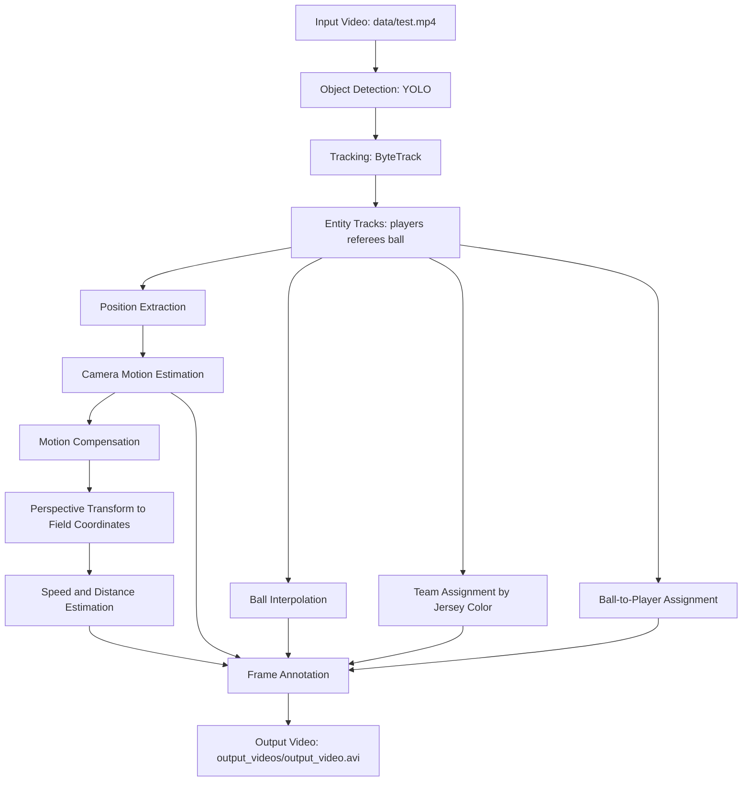

# Football Video Intelligence Pipeline: Tracking, Team Assignment, and Motion Analytics

## 1. Overview
This project is a computer-vision pipeline for football match analysis that transforms raw broadcast video into structured, frame-level analytics. It detects players, referees, and the ball; tracks entities across frames; compensates for camera motion; maps motion to a field-relative coordinate system; estimates player speed and distance; assigns teams by jersey color clustering; and estimates ball possession over time.

From an engineering perspective, the system solves a core sports analytics problem: converting noisy visual streams into stable, quantitative signals that can support tactical analysis, performance monitoring, and downstream AI/ML workflows.

Why this matters:
- Broadcast video is abundant, but raw pixels are not directly actionable.
- Reliable tracking + geometric normalization is the bridge from video to analytics.
- This pipeline demonstrates end-to-end systems thinking: perception, tracking, transformation, feature computation, and annotated output generation.

## 2. Features
- YOLO-based detection for players, referees, and ball.
- Multi-object tracking with ByteTrack for temporal identity consistency.
- Ball trajectory interpolation to fill missing detections.
- Camera motion estimation using sparse optical flow (Lucas-Kanade).
- Motion-compensated position adjustment per frame.
- Perspective transform from image plane to field-relative coordinates.
- Team assignment via KMeans clustering on player jersey colors.
- Ball possession attribution using nearest-player heuristic.
- Per-player speed (`km/h`) and cumulative distance (`m`) estimation.
- Rendered annotated output video with overlays for tracks, possession, camera movement, speed, and distance.
- Stub-based caching for faster iteration during development.

## 3. Tech Stack
- Python
- OpenCV (`cv2`) for video I/O, optical flow, geometry transforms, and rendering
- Ultralytics YOLO for object detection
- Supervision (ByteTrack integration) for tracking
- NumPy for vectorized numerical operations
- Pandas for interpolation of ball trajectories
- scikit-learn (`KMeans`) for unsupervised team color clustering
- Pickle for serialized stub caching

## 4. Architecture / Workflow


## 5. Project Structure
```text
football_analysis_yolo/
+-- main.py                                 # End-to-end pipeline orchestrator
+-- yolo_inference.py                       # Standalone YOLO inference test script
+-- image.png                               # Sample output snapshot
+-- trackers/
¦   +-- tracker.py                          # Detection, ByteTrack tracking, annotations
+-- camera_movement_estimator/
¦   +-- camera_movement_estimator.py        # Optical-flow camera motion estimation
+-- view_transformer/
¦   +-- view_transformer.py                 # Perspective mapping to field coordinates
+-- speed_and_distance_estimator/
¦   +-- speed_and_distance_estimator.py     # Speed/distance computation and overlays
+-- team_assigner/
¦   +-- team_assigner.py                    # Team clustering from jersey color features
+-- player_ball_assigner/
¦   +-- player_ball_assigner.py             # Ball possession assignment heuristic
+-- utils/
¦   +-- video_utils.py                      # Video read/write helpers
¦   +-- bbox_utils.py                       # Geometric and distance helper functions
+-- stubs/
    +-- track_stubs.pkl                     # Cached object tracks
    +-- camera_movement_stub.pkl            # Cached camera motion values
```

## 6. Installation
```bash
git clone <your-repo-url>
cd football_analysis_yolo
python -m venv .venv
# Windows
.venv\Scripts\activate
# Linux/macOS
# source .venv/bin/activate

pip install ultralytics supervision opencv-python numpy pandas scikit-learn
```

Required local assets before execution:
- Model weights at `models/best.pt`
- Input video at `data/test.mp4`
- Output directory `output_videos/` (create if missing)

## 7. Usage
Run the full analysis pipeline:
```bash
python main.py
```

Run YOLO-only quick check:
```bash
python yolo_inference.py
```

Implementation note:
- `main.py` currently reads detection/tracking and camera-motion data from stubs (`read_from_stub=True`) for faster development loops.
- Set these flags to `False` in `main.py` to recompute from raw video.

## 8. Example Output
Generated artifact:
- `output_videos/output_video.avi`

Frame overlays include:
- Player/referee/ball markers and IDs
- Team-wise possession percentage
- Camera movement `X/Y`
- Player speed (`km/h`) and distance (`m`)

Sample visualization:


## 9. Engineering Insights
- Detection and tracking separation: YOLO handles perception; ByteTrack enforces temporal continuity.
- Numerical robustness: missing ball detections are interpolated with Pandas before downstream analytics.
- Camera-motion compensation: optical-flow offsets reduce ego-motion bias in movement statistics.
- Geometric normalization: perspective mapping converts image coordinates into a field-referenced frame for physically meaningful distance/speed estimates.
- Practical caching: pickle stubs reduce iteration time while debugging visualization and metric logic.

Trade-offs:
- Team assignment via color clustering is efficient but sensitive to lighting, jersey similarity, and occlusion.
- Fixed frame-rate assumptions (`24 FPS`) simplify speed estimation but should be generalized for production.
- Ball possession heuristic (nearest foot-point under threshold) is interpretable but can fail in dense crowding.

Performance/scalability considerations:
- Detection is batched (`batch_size=20`) to improve inference throughput.
- For larger workloads, this architecture can be extended to stream processing, asynchronous stages, and GPU-backed inference services.

## 10. Learning Journey & AI/ML Foundations
### A. Computational & Mathematical Foundations
My foundation is rooted in computational thinking that directly aligns with AI/ML engineering:
- Mathematical modeling of dynamic systems.
- Numerical methods and computational solving strategies.
- Algorithmic problem-solving under real-world constraints.
- Matrix/vector-style computation patterns used in NumPy-based pipelines.
- Structured data transformation workflows conceptually aligned with Pandas-style processing.

### B. Current Academic Direction
I am currently pursuing an M.Tech in AI/ML, with academic focus on:
- Machine learning
- Deep learning
- Natural language processing (NLP)
- AI systems engineering

### C. Self-Driven Learning Narrative
This project is part of my self-driven transition into AI/ML engineering. I intentionally build implementation-heavy systems to connect theory with production-style execution, especially across computer vision pipelines, backend-oriented data flow, and model-adjacent analytics.

### D. Project to AI/ML Mapping
How this project connects to AI/ML system design:
- Tracking and trajectory extraction are foundational for behavior modeling and predictive analytics.
- Perspective transformation and motion compensation reflect the same geometric/data normalization principles used in robust ML preprocessing.
- Speed/distance derivation is feature engineering on spatiotemporal data.
- Modular pipeline stages mirror ML system architecture patterns (ingestion, transformation, feature computation, output serving).
- Stub-driven iteration mimics reproducible experimentation workflows used in model development.

### E. Narrative Positioning
This project is part of my transition into AI/ML, where I apply strong foundations in computational modeling and numerical methods to build scalable and intelligent systems.

### F. Core Insight
Even before specializing in AI/ML, I was working with computational algorithms, numerical methods, and system modeling, which form the backbone of modern machine learning systems.

## 11. Challenges & Learnings
- Camera movement confounds naive motion estimates; compensation is necessary before player-level kinematics.
- Ball detection is temporally sparse; interpolation is critical for stable possession analytics.
- Broadcast-view geometry distorts distances; field-coordinate mapping improves metric interpretability.
- Identity continuity and annotation quality require careful integration of detector and tracker outputs.
- Engineering productivity improves significantly with cached intermediate artifacts during iterative development.

## 12. Future Improvements
- Replace heuristic possession with learned interaction models (ball-player proximity + motion context).
- Add automatic homography calibration for different camera angles and stadium layouts.
- Make frame-rate and camera-parameter handling fully dynamic.
- Introduce quantitative evaluation metrics (tracking stability, possession accuracy, speed estimation error bounds).
- Package as a service-oriented pipeline (API + job queue + artifact storage) for scalable processing.
- Extend into downstream ML tasks: event classification, tactical pattern mining, and predictive play modeling.